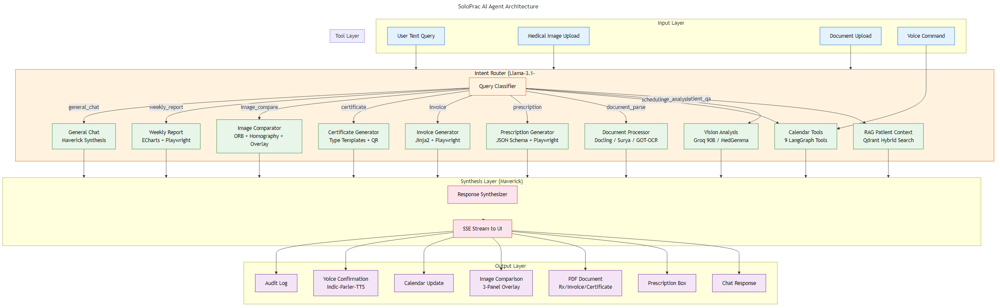

# SoloPrac AI — Agent Architecture Design

## 1. Agentic Framework

The agent system is built on **LangGraph** — a graph-based framework for orchestrating LLM agents. Unlike linear chains, LangGraph allows cyclic execution (plan-execute-critic loops), conditional branching, and dynamic tool selection.

---

## 2. Agent Architecture Diagram



---

## 3. Agent Components

### 3.1 Intent Router (Llama-3.1-8B via NIM)
The entry point for all user queries. A lightweight LLM that classifies intent and routes to the appropriate tool.

**Classification Categories:**
```
patient_qa       → RAG retrieval + synthesis
image_analysis   → Vision model (Groq 90B-V or MedGemma-4B)
document_parse   → OCR pipeline (Docling/Surya/GOT-OCR)
scheduling       → Calendar subgraph (9 tools)
prescription     → JSON Schema + PDF generation
invoice          → Billing → PDF
certificate      → Certificate template → PDF
image_compare    → ORB matching + overlay
weekly_report    → Significance scorer + PDF
general_chat     → Direct Maverick response
```

**Router Prompt Structure:**
```
User query: {query}
Patient context: {patient_id, doctor_id, timestamp}
Available tools: {tool_descriptions}
Past conversation: {conversation_history}

Classify the intent from the list above. Return JSON:
{"intent": "patient_qa", "confidence": 0.95}
```

### 3.2 RAG Retrieval Node (Feature A)
Executes temporal-aware multimodal retrieval from Qdrant. Implements the formal scoring function:

```python
score(v, q, t_q) = alpha * cos(MedCPT(q), v.medical_text)
                  + beta  * hybrid_bm25_dense(BGE-M3(q), v.hybrid, v.sparse)
                  + gamma * cos(NVCLIP(q_img), v.image)  # if query has image
                  + delta * temporal_decay(t_q - v.timestamp)
                  + epsilon * clinical_significance(v)
```

### 3.3 Response Synthesizer (Llama-4 Maverick via NIM)
Generates the final response grounded in retrieved context. Uses structured output to ensure citations are valid version references.

**Output Schema:**
```json
{
  "response": "Mrs. Sharma's HbA1c has been trending...",
  "citations": [{"version_id": "uuid", "version_number": 12, "summary": "HbA1c: 7.2%"}],
  "follow_up": {"suggested": true, "type": "lab_test", "name": "HbA1c after 4 weeks"}
}
```

### 3.4 Vision Analysis Node
Routes to either Groq Llama-3.2-90B-Vision (general images) or MedGemma-4B (radiology/dermatology) based on image type classification.

### 3.5 Document Processor Node
Multi-stage pipeline: file type detection → parser selection (Docling/Surya/GOT-OCR) → text extraction → schema alignment (Feature D) → structured patient data.

### 3.6 Image Registration Node
OpenCV ORB feature matching pipeline:
1. Detect ORB keypoints on new image
2. Search patient's prior images by NV-CLIP similarity
3. Match features via BFMatcher + Lowe's ratio test
4. Compute homography via RANSAC
5. Generate overlay image
6. Maverick generates clinical summary

### 3.7 Calendar Subgraph (9 Tools)
Specialized subgraph with locked tool set:
```python
TOOLS = [
    find_available_slots(),           # Tool 1
    create_appointment(),             # Tool 2
    reschedule_appointment(),         # Tool 3
    cancel_appointment(),             # Tool 4
    query_calendar_nl(),              # Tool 5
    bulk_reschedule(),                # Tool 6
    block_doctor_time(),              # Tool 7
    smart_rearrange(),                # Tool 8
    find_optimal_window(),            # Tool 9
]
```

### 3.8 Voice Flow
```
[Mic] → faster-whisper/IndicWhisper → [Transcript]
  → Maverick intent: scheduling only
  → Tool execution (parallel where independent)
  → Approval card to doctor UI
  → Confirm → arq emails → audit log → Indic-Parler-TTS confirmation
```

---

## 4. State Machine Design

```python
class AgentState(TypedDict):
    messages: list              # conversation history
    patient_id: UUID | None
    doctor_id: UUID
    current_version: int
    retrieved_versions: list
    tool_results: dict
    pending_proposals: list     # AI suggestions awaiting approval
    error_count: int
    trace_events: list          # streaming status updates
```

---

## 5. Streaming Architecture

Agent-trace events stream to UI via SSE:
```
event: trace
data: {"node": "router", "status": "completed", "output": {"intent": "patient_qa"}}

event: trace
data: {"node": "retrieve_patient_context", "status": "running"}

event: trace
data: {"node": "retrieve_patient_context", "status": "completed", "output": {"versions_found": 5}}

event: token
data: {"token": "Mrs.", "citation": null}

event: token
data: {"token": "Sharma", "citation": null}

event: token
data: {"token": "'s", "citation": {"version": 12, "summary": "HbA1c: 7.2%"}}

event: done
data: {"response_id": "uuid"}
```

---

## 6. Error Handling Strategy

| Failure Mode | Handling | Fallback |
|-------------|----------|----------|
| NIM API down | Retry 2x with exponential backoff | "Service degraded, please retry" |
| Groq rate limit | Cache current response; queue request | Use cached or simplified response |
| Qdrant timeout | Retry with simplified query | Return last N versions from SQL |
| MedGemma OOM | Unload, restart, retry | Use Groq 90B-V as fallback |
| OCR failure (all engines) | Return error with suggestion | "Please upload a clearer image" |
| Voice ASR low confidence | Request rephrasing | "Could you please repeat that?" |

---

## 7. Langfuse Observability

Every agent step is traced:
- **Root span:** Full user request
- **Nested spans:** Each node execution (router, retrieval, synthesis, tool)
- **Evaluation:** LLM-as-judge for answer faithfulness (Feature A metric)
- **Metrics:** Step count, latency per node, token usage, success rate

---

## 8. Paper Contributions Mapped to Agent

| Feature | Agent Component | Evaluation |
|---------|----------------|------------|
| **A** — Temporal RAG | Retrieval node with temporal scoring | Recall@5, future-leak rate, latency |
| **B** — Self-Planning | Planner-Executor-Critic loop | Steps-to-resolution vs fixed pipeline |
| **C** — Cross-Modal | Image retrieval via projected embeddings | Recall@k on CheXpert pairs |
| **D** — Schema Alignment | Document processor node | Field-level F1 across 5 doc types |
| **E** — Clustering | Offline trajectory analysis | Precision on injected deteriorations |
| **F** — Reports | Significance scorer + PDF pipeline | Likert rating vs unfiltered baseline |
