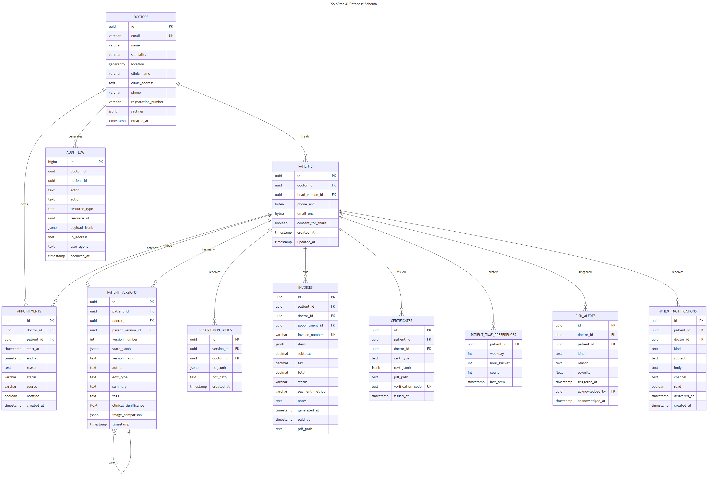

# SoloPrac AI — Database Schema Design

## 1. Schema Philosophy

### Versioned Immutable Records
The core architectural bet: patient data is **never updated in place**. Every change mints a new version, forming an immutable chain. This enables time-travel queries, medico-legal audit trails, and temporal-aware RAG.

### Multi-Tenant by Design
Every patient-bearing table includes `doctor_id` with PostgreSQL Row-Level Security (RLS) ensuring that even a buggy query cannot leak data across doctors.

### PII Encryption
Personally Identifiable Information (phone, email, address) is encrypted at rest using pgcrypto with application-layer key management.

### Cross-Clinic Patient Identity (NEW)
A `users` table (no RLS) stores cross-tenant user identity. Each clinic visit creates a `patient` row scoped to that doctor with `patient.user_id` FK to the shared `user`. Walk-in patients have `user_id = NULL`.

### Doctor Verification & Trust (NEW)
Doctors register with email/password, start as `unverified`. Upload registration number + license document → `pending_verification`. Admin approves → `verified` (appears in public search). Admin rejects → `rejected` with reason.

---

## 2. Entity Relationship Diagram



---

## 3. Table Definitions

### 3.1 Users (Cross-Tenant, No RLS)
```sql
CREATE TABLE users (
    id UUID PRIMARY KEY DEFAULT gen_random_uuid(),
    phone TEXT NOT NULL,
    phone_hash CHAR(64) NOT NULL UNIQUE,  -- sha256(phone) for O(1) lookup
    name TEXT,
    created_at TIMESTAMPTZ DEFAULT NOW(),
    updated_at TIMESTAMPTZ DEFAULT NOW()
);

CREATE INDEX idx_users_phone_hash ON users(phone_hash);
-- No RLS: users are cross-tenant identity
```

### 3.2 Doctors (Tenants)
```sql
CREATE TABLE doctors (
    id UUID PRIMARY KEY DEFAULT gen_random_uuid(),
    email TEXT UNIQUE NOT NULL,
    name TEXT NOT NULL,
    speciality TEXT DEFAULT 'General Practice',
    location GEOGRAPHY(POINT),              -- PostGIS for patient map search
    clinic_name TEXT,
    clinic_address TEXT,
    phone TEXT,
    registration_number TEXT,
    password_hash TEXT,                      -- bcrypt for email/password auth
    verification_status TEXT NOT NULL DEFAULT 'unverified',
    license_document_path TEXT,
    rejection_reason TEXT,
    verified_at TIMESTAMPTZ,
    settings JSONB NOT NULL DEFAULT '{}',   -- working_hours, notification_prefs, templates
    created_at TIMESTAMPTZ DEFAULT NOW()
);

-- Verification status: 'unverified' | 'pending_verification' | 'verified' | 'rejected'
```

**Settings JSONB Structure:**
```json
{
  "notification_preferences": {
    "appointment_reminder": {"enabled": true, "hours_before": 2, "channels": ["in_app", "email"]},
    "new_report": {"enabled": true, "channels": ["in_app", "email"]},
    "invoice_generated": {"enabled": true, "channels": ["in_app"]},
    "booking_confirmation": {"enabled": true, "channels": ["in_app", "email"]},
    "reschedule_notification": {"enabled": true, "channels": ["in_app", "email"]},
    "certificate_issued": {"enabled": true, "channels": ["in_app"]}
  },
  "patient_booking_enabled": true,
  "auto_confirm_booking": false,
  "max_future_booking_days": 30,
  "certificate_templates": {}
}
```

### 3.3 Patients (Per-Doctor Medical Record)
```sql
CREATE TABLE patients (
    id UUID PRIMARY KEY DEFAULT gen_random_uuid(),
    doctor_id UUID NOT NULL REFERENCES doctors(id) ON DELETE CASCADE,
    user_id UUID REFERENCES users(id) ON DELETE SET NULL,  -- cross-clinic identity
    head_version_id UUID REFERENCES patient_versions(id),
    phone_enc BYTEA, email_enc BYTEA,        -- pgcrypto encrypted
    consent_for_share BOOLEAN DEFAULT FALSE,
    created_at TIMESTAMPTZ DEFAULT NOW(),
    updated_at TIMESTAMPTZ DEFAULT NOW()
);

CREATE INDEX idx_patients_doctor_id ON patients(doctor_id);
CREATE INDEX idx_patients_user_id ON patients(user_id);
-- RLS enabled (see Section 4)
```

### 3.4 Patient Versions (Immutable Chain)
```sql
CREATE TABLE patient_versions (
    id UUID PRIMARY KEY DEFAULT gen_random_uuid(),
    patient_id UUID NOT NULL REFERENCES patients(id) ON DELETE CASCADE,
    doctor_id UUID NOT NULL REFERENCES doctors(id) ON DELETE CASCADE,
    parent_version_id UUID REFERENCES patient_versions(id),
    version_number INT NOT NULL,
    state_jsonb JSONB NOT NULL,               -- full patient state snapshot
    version_hash TEXT NOT NULL,                -- sha256(canonical_json(state_jsonb))
    author TEXT NOT NULL,                      -- 'doctor:<uuid>' | 'agent:<name>'
    edit_type TEXT NOT NULL,                   -- manual|voice|ocr|ai_suggestion|revert
    summary TEXT,
    tags TEXT[] DEFAULT '{}',
    clinical_significance REAL DEFAULT 0.0,
    image_comparison JSONB,                    -- {matched_version_id, area_change_pct, overlay_path}
    timestamp TIMESTAMPTZ NOT NULL DEFAULT NOW(),
    UNIQUE (patient_id, version_number)
);

CREATE INDEX idx_pv_patient_ts ON patient_versions (patient_id, timestamp DESC);
CREATE INDEX idx_pv_doctor_ts ON patient_versions (doctor_id, timestamp DESC);
-- RLS enabled (see Section 4)
```

**Version Hash Computation:**
```python
@staticmethod
def compute_hash(state: dict) -> str:
    canonical = json.dumps(state, sort_keys=True, separators=(",", ":"), ensure_ascii=False)
    return hashlib.sha256(canonical.encode("utf-8")).hexdigest()
```

### 3.5 Prescription Boxes
```sql
CREATE TABLE prescription_boxes (
    id UUID PRIMARY KEY DEFAULT gen_random_uuid(),
    version_id UUID NOT NULL REFERENCES patient_versions(id) ON DELETE CASCADE,
    patient_id UUID NOT NULL REFERENCES patients(id) ON DELETE CASCADE,
    doctor_id UUID NOT NULL REFERENCES doctors(id) ON DELETE CASCADE,
    rx_jsonb JSONB NOT NULL,
    pdf_path TEXT,
    created_at TIMESTAMPTZ DEFAULT NOW()
);
```

### 3.6 Invoices
```sql
CREATE TABLE invoices (
    id UUID PRIMARY KEY DEFAULT gen_random_uuid(),
    patient_id UUID NOT NULL REFERENCES patients(id) ON DELETE CASCADE,
    doctor_id UUID NOT NULL REFERENCES doctors(id) ON DELETE CASCADE,
    appointment_id UUID REFERENCES appointments(id),
    invoice_number TEXT NOT NULL UNIQUE,       -- auto-generated, e.g. INV-2026-0001
    items JSONB NOT NULL,                      -- [{description, qty, rate, amount}]
    subtotal DECIMAL(10,2) NOT NULL,
    tax DECIMAL(10,2) DEFAULT 0,
    total DECIMAL(10,2) NOT NULL,
    status TEXT NOT NULL DEFAULT 'pending',    -- pending|paid|cancelled
    payment_method TEXT,                       -- cash|upi|card|insurance
    notes TEXT,
    generated_at TIMESTAMPTZ DEFAULT NOW(),
    paid_at TIMESTAMPTZ,
    pdf_path TEXT
);
```

### 3.7 Certificates
```sql
CREATE TABLE certificates (
    id UUID PRIMARY KEY DEFAULT gen_random_uuid(),
    patient_id UUID NOT NULL REFERENCES patients(id) ON DELETE CASCADE,
    doctor_id UUID NOT NULL REFERENCES doctors(id) ON DELETE CASCADE,
    cert_type TEXT NOT NULL,                   -- sick_leave|fitness|school|disability|other
    cert_jsonb JSONB NOT NULL,
    pdf_path TEXT,
    verification_code TEXT UNIQUE,             -- QR code payload
    issued_at TIMESTAMPTZ DEFAULT NOW()
);
```

### 3.8 Appointments
```sql
CREATE TABLE appointments (
    id UUID PRIMARY KEY DEFAULT gen_random_uuid(),
    doctor_id UUID NOT NULL REFERENCES doctors(id) ON DELETE CASCADE,
    patient_id UUID NOT NULL REFERENCES patients(id) ON DELETE CASCADE,
    start_at TIMESTAMPTZ NOT NULL,
    end_at TIMESTAMPTZ NOT NULL,
    reason TEXT,
    status TEXT NOT NULL DEFAULT 'scheduled',   -- scheduled|done|cancelled|moved
    source TEXT NOT NULL DEFAULT 'manual',      -- manual|voice|agent|patient_portal
    notified BOOLEAN DEFAULT FALSE,
    created_at TIMESTAMPTZ DEFAULT NOW()
);
CREATE INDEX idx_appt_doctor_start ON appointments (doctor_id, start_at);
CREATE INDEX idx_appt_patient_start ON appointments (patient_id, start_at);
```

### 3.9 Patient Time Preferences (Smart Scheduling)
```sql
CREATE TABLE patient_time_preferences (
    patient_id UUID NOT NULL REFERENCES patients(id) ON DELETE CASCADE,
    weekday INT NOT NULL,                       -- 0-6 (Mon-Sun)
    hour_bucket INT NOT NULL,                   -- 0-23
    count INT NOT NULL DEFAULT 0,
    last_seen TIMESTAMPTZ,
    PRIMARY KEY (patient_id, weekday, hour_bucket)
);
```

### 3.10 Risk Alerts
```sql
CREATE TABLE risk_alerts (
    id UUID PRIMARY KEY DEFAULT gen_random_uuid(),
    doctor_id UUID NOT NULL REFERENCES doctors(id) ON DELETE CASCADE,
    patient_id UUID NOT NULL REFERENCES patients(id) ON DELETE CASCADE,
    kind TEXT NOT NULL,                          -- trajectory_drift|anomaly
    reason TEXT NOT NULL,
    severity REAL NOT NULL,                      -- 0-1
    triggered_at TIMESTAMPTZ DEFAULT NOW(),
    acknowledged_by UUID REFERENCES doctors(id),
    acknowledged_at TIMESTAMPTZ
);
```

### 3.11 Patient Notifications
```sql
CREATE TABLE patient_notifications (
    id UUID PRIMARY KEY DEFAULT gen_random_uuid(),
    patient_id UUID NOT NULL REFERENCES patients(id) ON DELETE CASCADE,
    doctor_id UUID NOT NULL REFERENCES doctors(id) ON DELETE CASCADE,
    kind TEXT NOT NULL,                          -- appointment_reminder|report_available|invoice_generated|booking_confirmed|rescheduled|certificate_issued
    subject TEXT NOT NULL,                       -- AI-generated
    body TEXT NOT NULL,                          -- AI-generated
    channel TEXT[] DEFAULT '{in_app}',           -- in_app|email|sms
    meta JSONB,                                  -- {resource_type, resource_id, pdf_url, ...}
    read BOOLEAN DEFAULT FALSE,
    delivered_at TIMESTAMPTZ,
    created_at TIMESTAMPTZ DEFAULT NOW()
);
```

### 3.12 Audit Log (Append-Only)
```sql
CREATE TABLE audit_log (
    id BIGSERIAL PRIMARY KEY,
    doctor_id UUID NOT NULL,
    patient_id UUID,
    actor TEXT NOT NULL,                          -- doctor:<id>|patient:<id>|agent:<name>|system
    action TEXT NOT NULL,                          -- read|write|ai_suggest|approve|export|book|cancel
    resource_type TEXT NOT NULL,                   -- patient|version|appointment|rx|invoice|certificate|report
    resource_id UUID,
    payload_jsonb JSONB,
    ip_address INET,
    user_agent TEXT,
    occurred_at TIMESTAMPTZ DEFAULT NOW()
);
CREATE INDEX idx_audit_doctor_time ON audit_log (doctor_id, occurred_at DESC);
```

---

## 4. Row-Level Security Policies

Every patient-bearing table has RLS enabled with the same policy pattern:

```sql
-- Enable RLS
ALTER TABLE patients ENABLE ROW LEVEL SECURITY;
ALTER TABLE patient_versions ENABLE ROW LEVEL SECURITY;
ALTER TABLE prescription_boxes ENABLE ROW LEVEL SECURITY;
ALTER TABLE invoices ENABLE ROW LEVEL SECURITY;
ALTER TABLE certificates ENABLE ROW LEVEL SECURITY;
ALTER TABLE appointments ENABLE ROW LEVEL SECURITY;
ALTER TABLE risk_alerts ENABLE ROW LEVEL SECURITY;
ALTER TABLE patient_notifications ENABLE ROW LEVEL SECURITY;

-- Policy: tenant isolation via app.current_doctor_id
CREATE POLICY tenant_isolation ON patients
  USING (doctor_id = current_setting('app.current_doctor_id')::uuid);

CREATE POLICY tenant_isolation ON patient_versions
  USING (doctor_id = current_setting('app.current_doctor_id')::uuid);

CREATE POLICY tenant_isolation ON prescription_boxes
  USING (doctor_id = current_setting('app.current_doctor_id')::uuid);

CREATE POLICY tenant_isolation ON invoices
  USING (doctor_id = current_setting('app.current_doctor_id')::uuid);

CREATE POLICY tenant_isolation ON certificates
  USING (doctor_id = current_setting('app.current_doctor_id')::uuid);

CREATE POLICY tenant_isolation ON appointments
  USING (doctor_id = current_setting('app.current_doctor_id')::uuid);

CREATE POLICY tenant_isolation ON risk_alerts
  USING (doctor_id = current_setting('app.current_doctor_id')::uuid);

CREATE POLICY tenant_isolation ON patient_notifications
  USING (doctor_id = current_setting('app.current_doctor_id')::uuid);
```

**How it works:**
- FastAPI middleware sets `SET LOCAL app.current_doctor_id = '<uuid>'` after JWT auth
- Even if an ORM query forgets a WHERE clause, RLS enforces isolation
- Backup restoration cannot leak data across tenants
- `users` table has NO RLS (cross-tenant by design)

---

## 5. Data Integrity & Performance

| Feature | Implementation | Benefit |
|---------|---------------|---------|
| Version Hash | `sha256(canonical_json(state))` | Content-addressable; tamper-evident |
| Unique Constraint | `UNIQUE(patient_id, version_number)` | Prevents version gaps/duplicates |
| Foreign Keys | All relationships enforced | Referential integrity |
| Composite Indexes | Time-bound queries covered | <50ms timeline queries |
| JSONB Columns | Flexible patient state schemas | Schema-less per version |
| Partial Indexes | Active appointment filtering | Fast calendar queries |
| Phone Hash Index | `users.phone_hash` SHA256 | O(1) OTP user lookup |

---

## 6. Migration Notes (init-schema.sql)

The canonical schema is in `init-schema.sql` at repo root. Key differences from legacy:

| Legacy | New |
|--------|-----|
| `patients.phone_enc` only | `patients.user_id` FK → `users.id` |
| `doctors` no auth columns | `doctors.password_hash`, `verification_status`, `license_document_path`, `rejection_reason`, `verified_at` |
| No `users` table | `users` table with `phone_hash` for OTP flow |
| Walk-in = patient row | Walk-in = `user_id = NULL` patient row |

Run migration:
```bash
psql -d soloprac -f init-schema.sql
```
