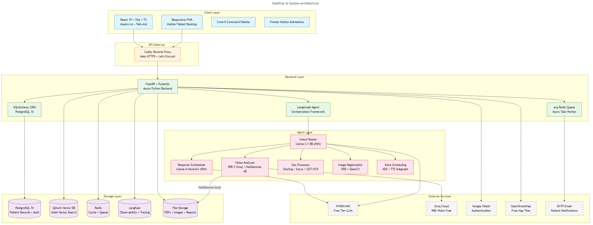

# SoloPrac AI — System Architecture & Design

## 1. Overview

SoloPrac AI is a **multimodal, agentic clinical operating system** for solo medical practitioners. The system is designed around a **version-controlled patient intelligence layer** where every consultation mints a new immutable version (like a Git commit), every AI suggestion is auditable, and every retrieval is temporally aware.

This document describes the complete system architecture, module decomposition, and API design.

---

## 2. Architectural Philosophy

| Principle | Description |
|-----------|-------------|
| **Versioned Writes Only** | No in-place UPDATE on patient state — always append a new version. |
| **Doctor-in-the-Loop** | Every AI mutation is a proposal until the doctor confirms. |
| **Async-First** | Every I/O path is async; heavy jobs run in arq Redis queue. |
| **Structured Output** | All LLM-driven mutations use JSON Schema + Pydantic validation. |
| **Observability** | Every LLM call, agent step, retrieval is traced in Langfuse. |
| **Multi-Tenant Isolation** | Row-Level Security on every table; Qdrant filters enforced at API layer. |

---

## 3. System Architecture Diagram



### 3.1 Layer Description

| Layer | Components | Responsibility |
|-------|------------|----------------|
| **Client Layer** | React 19 + Vite + shadcn/ui + Tailwind + Framer Motion | Doctor-facing app and patient portal (same codebase, different routes) |
| **API Gateway** | Caddy Reverse Proxy | Auto-HTTPS via Let's Encrypt, request routing, static file serving |
| **Backend Layer** | FastAPI + Pydantic + SQLAlchemy + arq | REST API, async task processing, database ORM |
| **Agent Layer** | LangGraph + Multiple LLM Nodes | Intent routing, RAG retrieval, vision analysis, document processing, voice scheduling |
| **Storage Layer** | PostgreSQL 16 + Qdrant + Redis + Langfuse + File Storage | Relational data, vector embeddings, caching, observability, document storage |
| **External Services** | NVIDIA NIM, Groq, Google OAuth, OpenStreetMap, SMTP | Free-tier LLMs, auth, maps, email |

### 3.2 Data Flow

```
User Request (Chat/Image/Voice/Document)
    ↓
Caddy Reverse Proxy (HTTPS termination)
    ↓
FastAPI Router (auth check, tenant isolation)
    ↓
LangGraph Agent (intent classification)
    ↓
Tool Execution (RAG / Vision / Document / Calendar)
    ↓
Maverick Synthesis (response generation)
    ↓
SSE Stream (real-time tokens to UI)
    ↓
Audit Log (every action recorded)
```

---

## 4. Module Decomposition

### Module 1 — Version-Controlled Patient Records
The core innovation. Every patient write creates an immutable version with content-addressed hash (`sha256(canonical_json(state))`). Versions form a chain via `parent_version_id`, and the patient's current state is simply the head of this chain.

**Key APIs:**
- `GET /patients/{id}` — Current head state
- `GET /patients/{id}/timeline` — Ordered version list with summaries
- `GET /patients/{id}/at_version/{n}` — Historical state reconstruction
- `GET /patients/{id}/diff?v1=5&v2=7` — Field-level comparison
- `POST /patients/{id}/revert/{n}` — New version from historical state
- `PATCH /patients/{id}/fields` — Inline edit with optimistic locking

### Module 2 — Dynamic Agentic Router (LangGraph)
Single entry point classifying user intent and dispatching to the correct tool/model.

**Tools:**
- `retrieve_patient_context` — Qdrant hybrid search with temporal decay
- `synthesize_response` — Llama-4 Maverick response generation
- `analyze_image` — Groq 90B-V / MedGemma-4B vision analysis
- `compare_images` — ORB feature matching + overlay generation
- `parse_document` — Docling / Surya / GOT-OCR pipeline
- `generate_prescription_box` — Structured JSON Rx → PDF
- `generate_invoice` — Line item billing → PDF
- `generate_certificate` — Medical certificate → PDF with QR verification
- `schedule_subgraph` — 9 calendar tools (voice + text)
- `generate_weekly_report` — Significance-filtered digest → PDF

### Module 3 — Multimodal RAG Console
Primary chat interface with temporal-aware retrieval. Supports text and image input with inline citations to specific patient versions.

### Module 4 — Image Registration for Clinical Comparison
ORB feature matching between consecutive patient photos (wounds, skin conditions). Produces overlay images with clinical summary.

### Module 5 — Document Engine
Intelligent document parsing pipeline with auto-routing: typed PDF → Docling, scanned PDF → Surya + Docling, handwritten Rx → GOT-OCR 2.0, photos → Surya + MedGemma.

### Module 6 — Prescription Highlight Box
AI-generated, JSON-validated prescription cards rendered in-app and as print-ready PDFs via Jinja2 + Playwright.

### Module 7 — Invoice/Billing System
Track patient billing with auto-generated invoice numbers, line items, tax calculations, and PDF output (same pipeline as prescriptions).

### Module 8 — Medical Certificate Generator
Type-based certificate templates (sick leave, fitness, school) with QR verification codes. Same PDF pipeline.

### Module 9 — Calendar + Voice Scheduling
LangGraph subgraph with 9 tools covering booking, rescheduling, cancellation, bulk operations, doctor-off handling, and smart rearrangement with patient preference learning.

### Module 10 — Patient Web Portal
Lightweight patient interface in the same React app (`/patient/*` routes). Features include doctor search with Leaflet.js + OpenStreetMap, appointment booking, report download, and AI-generated notifications via WebSocket.

---

## 5. Security Architecture

| Layer | Mechanism |
|-------|-----------|
| **Auth** | Google OAuth → JWT (short-lived) + refresh token in HttpOnly cookie |
| **Tenant Isolation** | `doctor_id` on every table + PostgreSQL Row-Level Security |
| **Vector DB** | Every Qdrant query has `must` filter on `doctor_id` at API layer |
| **Encryption at Rest** | pgcrypto for PII columns; files encrypted via age/sops |
| **Encryption in Transit** | Caddy auto-HTTPS (Let's Encrypt) |
| **Audit Log** | Append-only `audit_log` table for every read/write |
| **Rate Limiting** | slowapi per-doctor RPM limits |
| **Input Validation** | Pydantic everywhere; file upload allowlist + magic-byte check |
| **Prompt Injection Defense** | Sanitized OCR text; structured output (JSON Schema) |

---

## 6. Deployment Architecture

Development: Docker Compose on local RTX 3050 machine.
Production: Docker Compose → Oracle Cloud Free Tier (4 ARM cores + 24 GB RAM).

**Services (8 Docker containers):**
1. FastAPI backend
2. PostgreSQL 16 + PostGIS
3. Qdrant vector database
4. Redis (cache + arq queue)
5. Langfuse (observability)
6. Caddy (reverse proxy)
7. Playwright (PDF generation)
8. Frontend (React, served via Caddy or standalone)

---

## 7. Scalability Considerations

- **Horizontal scaling:** Each doctor = isolated tenant; can scale by adding compute
- **Async processing:** Embeddings, PDF generation, and email send via arq queue
- **Caching:** Embeddings and ASR outputs cached by content hash
- **GPU strategy:** Only one local model on RTX 3050 at a time; swap on demand via orchestrator
