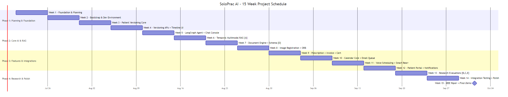
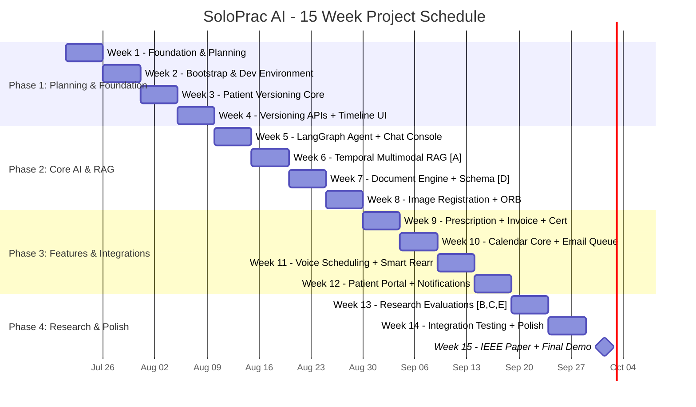

# SoloPrac AI — 15-Week Project Schedule & Gantt Chart

## 1. Gantt Chart



### 1.1 Mermaid Source


---

## 2. Detailed Week-by-Week Task Breakdown

### Phase 1: Planning & Foundation (Weeks 1-4)

| Week | Rohan (Backend/Arch/RAG) | Ranveer (Frontend/OCR) | Nihal (AI/Image/Voice) | Dev (Security/Planning) |
|:----:|:-------------------------|:-----------------------|:-----------------------|:------------------------|
| **1** | System architecture design; Tech stack finalization; DB schema (ER); Agent architecture | Literature survey (5 EMR systems); Feature finding; Comparison table; Paper intro draft | Gap analysis; Feature mapping to A-F; Market research (solo GP); Clinical workflow study | Project proposal; Feasibility study; 15-week Gantt chart; HW/SW requirements |
| **2** | Docker Compose (8 services); FastAPI skeleton; Postgres schema init; Health endpoints | React 19 + Vite + TS scaffold; shadcn/ui + Tailwind; Base layout (4-panel); Framer Motion | Qdrant named vectors config; Embedding models local; Redis + arq setup; NIM/Groq API keys | Google OAuth + JWT; RLS policies on all tables; .env template + secrets; Pre-commit hooks |
| **3** | patient_versions table; Hash chain logic; Head pointer CRUD; Version minting POST | Patient list + search; Cmd+K palette; Basic detail view; Left rail UI | LangGraph skeleton; Router node (8B); Tool registry pattern; NIM connectivity test | Audit log table + middleware; CORS strict; slowapi rate limits; Security middleware |
| **4** | Diff endpoint; Revert endpoint; PATCH /fields (optimistic); Author tagging | Timeline scrubber (FM); Version nodes colored; Hover popover; Click → historical view | MedCPT pipeline (768d); BGE-M3 pipeline (1024d); Qdrant points + payload; arq embedder | pgcrypto PII; Version audit; RLS verification; Optimistic locking |

---

### Phase 2: Core AI & RAG (Weeks 5-8)

| Week | Rohan (Backend/Arch/RAG) | Ranveer (Frontend/OCR) | Nihal (AI/Image/Voice) | Dev (Security/Planning) |
|:----:|:-------------------------|:-----------------------|:-----------------------|:------------------------|
| **5** | LangGraph main agent; Maverick synth node; SSE streaming; Tool integration | Chat UI + mic button; SSE EventSource hook; Streaming animation; Agent trace UI | BiomedCLIP (512d) pipeline; Qdrant image vector; Hybrid search API; Image upload endpoint | Prompt injection defense; JSON Schema enforcement; Doctor ID injection; Session mgmt |
| **6** | **Feature A**: temporal_multimodal_retrieve(); RRF fusion; Temporal decay; Significance scoring | Citation chips [v12]; Click→scrubber; Right rail context; Inline edit mode | MIMIC-IV synthetic data; Evaluation harness (Recall@5, leak rate, p95); Baseline BM25/MedCPT | Qdrant filter enforcement; RAG audit logging; LLM rate limits; Future-leak validation |
| **7** | Docling + Surya + Nanonets-OCR2; Parser router (4 types); Scratchpad route | Drag-drop upload; Scratchpad /scratchpad; "Save to patient"; Progress + preview | **Feature D**: Maverick schema alignment; Few-shot prompt (3 ex); Pydantic validate; MedGemma fallback | Magic-byte validation; Upload allowlist; OCR sanitization; Upload rate limits |
| **8** | ORB feature matching; Homography (RANSAC); Overlay generation; Comparison API | 3-panel view (Prev/Curr/Overlay); Opacity slider; Metrics display; "Add to record" btn | Maverick clinical summary; Versioned comparison entry; BiomedCLIP embeddings; Feature C pair collection | Encrypted image storage; Size/format validation; Image audit log; RLS for images |

---

### Phase 3: Features & Integrations (Weeks 9-12)

| Week | Rohan (Backend/Arch/RAG) | Ranveer (Frontend/OCR) | Nihal (AI/Image/Voice) | Dev (Security/Planning) |
|:----:|:-------------------------|:-----------------------|:-----------------------|:------------------------|
| **9** | Jinja2→Playwright PDF pipeline; Rx/Invoice/Cert CRUD; Auto invoice #; QR codes | Rx highlight box; Invoice UI + status; Cert UI + preview; Print button | Maverick structured Rx JSON; Maverick invoice items; Maverick cert templates; MedGemma fallback | PDF watermark + disclaimer; QR verification endpoint; PDF audit log; Two-step confirm |
| **10** | Calendar tools 1-4; arq email queue; Working hours parser; Buffer time enforcement | Weekly calendar view; Slot picker UI; Working hours editor; Appt detail card | Patient preference histogram; Voice router node; faster-whisper (EN); IndicWhisper (HI) | Notification prefs schema; Appt audit log; RLS on appointments; Calendar rate limits |
| **11** | Calendar tools 5-9; Smart rearrange ranker; Doctor-off scenario; Voice subgraph | Approval card UI; Voice confirmation UI; "I'm off" one-click; Mobile calendar | Maverick intent classification; Indic-Parler-TTS (EN+HI); Voice subgraph E2E; 5 commands test | WS auth for voice; Voice session audit; Voice rate limits; Two-step confirm |
| **12** | Patient portal APIs; Doctor search (PostGIS); Patient booking; WS /patient/{id} | /patient/* routes; Leaflet + OSM map; Patient dashboard; Booking flow | Maverick AI notifications; patient_notifications CRUD; WS dispatch; Email fallback | Patient OAuth + OTP; Patient RLS; Notification toggles; Portal security audit |

---

### Phase 4: Research & Polish (Weeks 13-15)

| Week | Rohan (Backend/Arch/RAG) | Ranveer (Frontend/OCR) | Nihal (AI/Image/Voice) | Dev (Security/Planning) |
|:----:|:-------------------------|:-----------------------|:-----------------------|:------------------------|
| **13** | **Feature B**: Self-planning agent; Feature B eval (100 queries); **Feature F**: Significance scorer + 3 layouts; Feature F eval design | 3 report layout previews; Report settings per patient; Risk alerts UI; Report download | **Feature C**: Linear projector training (InfoNCE); CheXpert prep; **Feature E**: HDBSCAN trajectories; Feature E eval | Feature C eval (Recall@k); Feature E data security; Langfuse metrics export; Anonymization check |
| **14** | E2E integration testing; Perf optimization; Docker Compose final; Bug fixes | UI polish (spacing, colors); Dark mode verification; Mobile responsive; Demo flow script | Langfuse dashboards final; All A-F metrics collected; GPU model swap final; Voice latency <3s | Full security audit; Pen-test cross-tenant; Audit log completeness; Oracle Cloud deploy |
| **15** | **Paper**: Intro + Arch + Feature A; Feature B section; Arch diagram (Mermaid→PNG); IEEEtran formatting | **Demo video** (5 min); Paper figures (charts, screenshots); Feature F section; Presentation slides | **Paper**: Feature C + D + E; Related Work + BibTeX; Ablation studies; Results tables | **Paper**: Security + Limitations + Ethics; Comparison table; Final deploy verify; Project submission |

---

## 3. Milestone Deliverables

| Milestone | Week | Deliverable | Demo Target |
|:---------|:----:|:------------|:------------|
| **M1** | 4 | Versioned patient records + timeline UI + auth | Mentor Review 1 |
| **M2** | 8 | Temporal RAG + Documents + Image Registration | Mentor Review 2 |
| **M3** | 12 | Full doctor app + Voice + Patient Portal | Mentor Review 3 |
| **M4** | 15 | Complete system + IEEE Paper + Demo video | Final Submission |

---

## 4. Dependency Graph

```
w1 → w2 → w3 → w4 → w5 → w6 → w7 → w8 → w9 → w10 → w11 → w12 → w13 → w14 → w15
  │    │    │    │    │    │    │    │    │    │     │     │     │     │     │
  ▼    ▼    ▼    ▼    ▼    ▼    ▼    ▼    ▼    ▼     ▼     ▼     ▼     ▼     ▼
Arch Auth VC  TL   LG   RAG  Doc  IMG  PDF  CAL  VOI   POR   EVA   INT   PAP
     (R) (R) (R) (R) (N) (R)  (R)  (N)  (R)  (N)   (R)   (N)   (D)   (All)
```

**Key:** LG = LangGraph, RAG = Feature A, VC = Version Chain, TL = Timeline, IMG = Image Reg, VOI = Voice, POR = Portal, EVA = Evaluations, INT = Integration, PAP = Paper

---

## 5. Risk Buffers

| Risk | Buffer Weeks | Contingency |
|:-----|:------------:|:------------|
| GPU/model issues | 1 (wk 13-14) | CPU fallback; simplify local models |
| Integration delays | 1 (wk 14) | Feature flags; ship core first |
| Evaluation complexity | 1 (wk 13) | Pre-build harnesses in w6, w7, w8 |
| Mentor feedback delays | Built-in | Async reviews; weekly checkpoints |
| Team member issues | Cross-training | AI code gen handles 80% boilerplate |

---

## 6. Success Criteria Per Phase

| Phase | Criteria |
|:-----|:---------|
| **Phase 1** (w1-4) | `docker compose up` works; patient CRUD + version chain + timeline UI visible |
| **Phase 2** (w5-8) | Chat answers with citations; doc upload parses; wound photo compares |
| **Phase 3** (w9-12) | Rx/Invoice/Cert PDFs print; voice books appt; patient books on map |
| **Phase 4** (w13-15) | All 6 features evaluated; paper 5-6 pages; demo video <5 min; deployed URL |