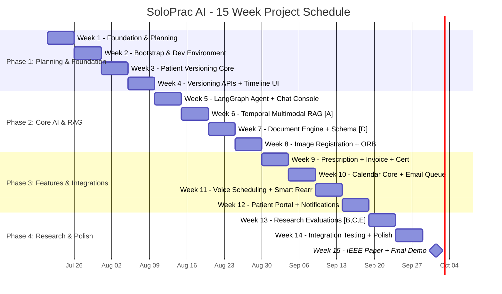

# SoloPrac AI — 15-Week Project Schedule & Gantt Chart

## 1. Gantt Chart

### 1.1 Mermaid Source

---

## 2. Milestone Status

| Milestone | Week | Deliverable | Status |
|:---------|:----:|:------------|:------:|
| **M1** | 4 | Versioned patient records + timeline UI + auth | **Done** |
| **M2** | 8 | Temporal RAG + Documents + Image Registration | **Done** |
| **M3** | 12 | Full doctor app + Voice + Patient Portal | **Done** |
| **M4** | 15 | Complete system + IEEE Paper + Demo video | **In Progress** |

---

## 3. What Was Built (Weeks 1-14)

| Week | Completed Features |
|:----:|:-------------------|
| **1-2** | Docker Compose, FastAPI skeleton, React scaffold, auth (email+password), RLS, audit log |
| **3-4** | Patient versioning core, hash chain, timeline scrubber, inline edit, diff/revert |
| **5-6** | LangGraph agent, Maverick synth, SSE streaming, MedCPT/BGE-M3/BiomedCLIP embeddings, Qdrant |
| **7-8** | Feature A (Temporal RAG), Document engine (Docling/Surya/Nanonets-OCR2), OCR quality alerts |
| **9-10** | Prescription Box, Invoice, Certificates, state-specific Rx, Calendar core, booking dialog |
| **11-12** | Voice scheduling (5 commands), voice-to-text (PrescriptionBox + ChatUI), Patient portal |
| **13-14** | Doctor search (PostGIS + PIN), profile photos, NMC verification, DPDP consent, Hindi UI, PWA, Sentry, backup, sessions |

---

## 4. What Remains (Week 15)

| Task | Owner | Status |
|------|:-----:|:------:|
| IEEE paper draft | All | In Progress |
| Demo video recording | All | Pending |
| Final integration testing | All | In Progress |
| Oracle Cloud deployment | Dev | Pending |
| Doctor feedback session | Rohan | Pending |
